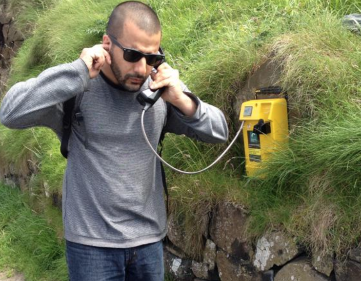

## Hello. 

My name is Matt. I'm an Associate Professor Language & Technology and the Director of the [Voice Technology MSc.](/VoiceTech) at the University of Groningen Campus Fryslân. I am by training a linguist and work on auditory perception, voice technology, and minority languages. This page provides gives more insight into what I'm working on. You can read about my [research](/Research), [academic appointments](/Academia), and [news](/News). Contact info is [here](/Contact).

